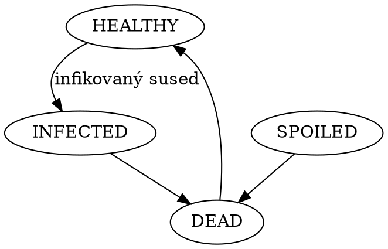
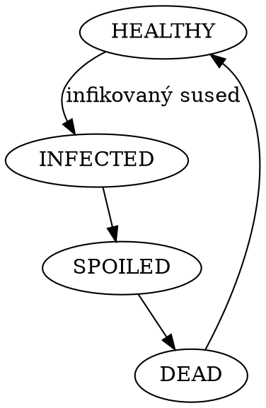
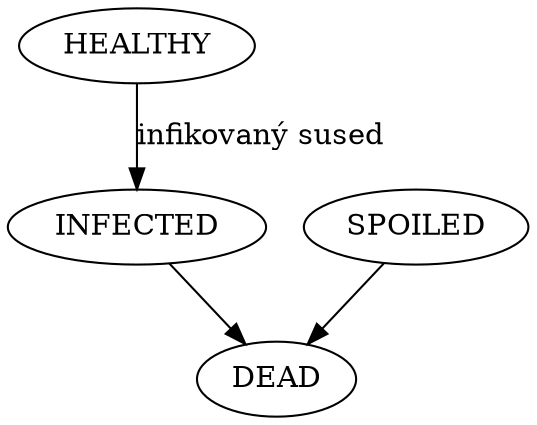
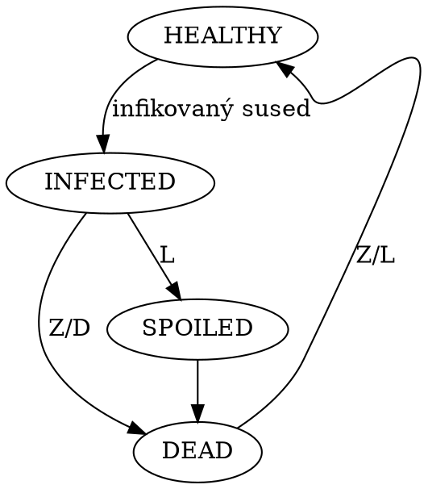

# Modelovanie dynamiky vírusu Ebola celulárnym automatom

# 1. Úvod

Vírus Ebola je filovírus spôsobujúci vážne ochorenia väčšine ľudí, ktorí s ním prídu do kontaktu.
Úmrtnosť pacientov je podľa správy[2] Svetovej zdravotníckej organizácie (WHO) z roku 2014 približne 70.8%.

Vzhľadom na extrémnu virulenciu Eboly sú možnosti pitiev a skúmania telesných tekutín pacientov značne obmedzené[3]. Počítačový model správania vírusu sa tak stáva cenným nástrojom pri skúmaní priebehu ochorenia, reakcie imunitného systému a potencionálneho nasadenia liekov. Model celulárneho automatu je založený na predchádzajúcom výskume vírusu HIV, ktorého negatívny dopad na imunitný systém je Ebole značne podobný[4].

V tomto článku predstavíme tri celulárne automaty, ktoré modelujú správanie sa vírusu pri rôznych reakciách imunitného systému. Na základe týchto troch celulárnych automatov zostavíme stochastický celulárny automat (SCA), modelujúci priebeh ochorenia pri variabilnej reakcii imunitného systému danej vstupnými parametrami.

Pomocou experimentov na zostavenom SCA budeme sledovať závislosť šírenia sa infekcie na pravdepodobnostiach druhov reakcií imunitného sytému. Zmyslom experimentov je zistiť vplyv spôsobu reakcie imunitného systému na úmrtnosť pacientov nakazených vírusom Ebola. Koncepcia bude overená porovnaním s údajmi o dobe liečby a miere úmrtnosti pacientov.

## 1.1 Zdroje faktov

### 1.1.1 Autori
- Eduard Čuba <xcubae00@stud.fit.vutbr.cz>
- Jakub Kulich <xkulic03@stud.fit.vutbr.cz>

### 1.1.2 Literatúra

Hlavným zdrojom, z ktorého táto štúdia vychádza je:

[Emily Burkhead, Jane Hawkins, A cellular automata model of Ebola virus dynamics, In Physica A: Statistical Mechanics and its Applications, Volume 438, 2015, Pages 424-435, ISSN 0378-4371](https://doi.org/10.1016/j.physa.2015.06.049)

Ako ďalšie zdroje boli použité zdroje, ktoré hlavný článok cituje. Ich zoznam je uvedený v sekcii [Bibliografia](#bibliografia).

## 1.2 Overenie validity

O víruse Ebola so toho stále vie pomerne málo. Rôzne zdroje hovoria o mortalite v rozmedzí 25 až 90%[1]. Takto význačná odchýlka môže spôsobiť signifikantný rozdiel medzi výsledkami experimentov a realitou. Dáta o mortalite sú v rozvojových krajinách skreslené problematickou identifikáciou a nahlásením ochorenia[8]. V štúdii sa budeme odvíjať od údajov, ktoré publikovala Svetová zdravotnícka organizácia (WHO). Okrem údajov o mortalite je pre modelovanie šírenia vírusu dôležité správne interpretovať spôsob replikácie vírusu, ktorá vychádza z podobnosti s vírusom HIV. Validita modelu Eboly spolieha na validitu modelov používaných pre vírus HIV a správne predpoklady o podobnostiach a rozdieloch v replikácii týchto vírusov.

# 2. Rozbor tématu a použitých metod/technologií

Šírenie HIV, jeho efekt na organizmus a odozva na užívanie liekov bolo niekoľko krát skúmané a modelované pomocou stochastických celulárnych automatov([5, 6, 7]). Časové okno vírusu Ebola je kratšie[1], ako pri víruse HIV. U pacientov, ktorí nákazu vírusom Ebola prežili neboli pozorované vážne chronické následky[8].

V tejto štúdii sa preto zameriame na adaptáciu počiatočných fáz dynamiky modelu HIV z článku [5]. Pomocou celulárneho automatu budeme modelovať šírenie infekcie Eboly v jednom orgáne. Originálny model upravíme tak, aby jeho parametre a pravidlá pre šírenie infekcie zodpovedali dynamike vírusu Ebola. Z doposiaľ získaných poznatkov sa predpokladá[1], že miera mutácia vírusu Ebola je podstatne nižšia, ako pri víruse HIV. Preto je jednou z významných úprav pôvodného modelu nahradenie pravidla predstavujúceho mutáciu vírusu pravidlom, ktoré reflektuje oneskorenú, alebo spomalenú reakciu imunitného systému. Zvyšné pravidlá zostanú rovnaké. Táto malá zmena však spôsobí urýchlenie priebehu infekcie, čo vedie k pomerne rýchlemu vyzdraveniu, alebo smrti. Doba trvania príznakov je zvyčajne 2 až 21 dní[8]. Pacienti, ktorých stav sa nezlepší zvyčajne umierajú na šok, vykrvácanie, alebo zlyhanie orgánov[8]. Terminálna podmienka zastúpenia zdravých buniek sa pohybuje približne na úrovni jednej tretiny[1] - ak pomer zdravých buniek ku všetkým bunkám klesne pod jednu tretinu, človek zomrie.

Dáta o počiatočnej miere infekcie v orgáne v súčastnej dobe nie sú presne dostupné[1], budeme preto vychádzať z údajov používaných pre modelovanie infekcie HIV[5], ktoré sú na úrovni $(10^{-2} + 10^{-3})/2 = 0.0055$. 

## 2.1 Celulárny automat

V experimentoch chceme sledovať šírenie infekcie medzi bunkami pomocou predom definovaných krokov. Využijeme na to model celulárneho automatu. Ten je typicky definovaný nasledujúcimi prvkami[IMS 317]:
- bunka (Cell) - základný element, ktorý môže byť v jednom z konečného počtu stavov
- pole buniek (Lattice) - n-rozmerné, rovnomerné rozdelenie priestoru
- okolie (Neighbourhood) - počet a pozícia okolitých buniek, s ktorými sa pracuje
- pravidlá - funkcia stavu bunky a jej okolia definujúca nový stav bunky

Použitie celulárneho automatu nám umožní modelovať šírenie vírusu medzi bunkami naprieč generáciami buniek.

# 3. Koncepcia

V tejto kapitole uvedieme modely celulárnych automatov, ktoré sme využívali na simuláciu šírenia vírusu. Pre začiatok si uvedieme jednoduchý základný model, ktorý predstavuje šírenie vírusu pri správnom fungovaní imunitného systému. Následne uvedieme dve obmeny tohoto modelu, ktoré modelujú šírenie vírusu pri spomalenej, alebo vyčerpanej imunitnej reakcii. S využitím týchto troch modelov zostavíme stochastický celulárny automat, ktorého krok pre každú generáciu bude krokom jedného z predstavených automatov. Konkrétny na krok sa určí na základe vstupných pravdepodobností.

## 3.1 Základný model šírenia vírusu

V nasledujúcich podkapitolách bližšie špecifikujeme základný model celulárneho automatu, z ktorého budú ďalšie modely vychádzať.

### 3.1.1 Bunka

V našom celulárnom automate môže bunka byť v jednom zo stavov $\{0 ,1, 2, 3, 4\}$.
- $0$ reprezentuje zdravú bunku (v simulácii značená ako _HEALTHY_)
- $1$ reprezentuje infikovanú bunku (v simulácii značená ako _INFECTED_)
    - infikovaná bunka môže infikovať okolité bunky
- $2$ reprezentuje infikovanú bunku, ktorá kvôli spomalenej reakcii imunitného systému nebola zabitá (v simulácii značená ako _SPOILED_)
- $3$ reprezentuje mŕtvu bunku (v simulácii značená ako _DEAD_)

### 3.1.2 Pole buniek

Infekcia sa môže šíriť v orgánoch rôznych tvarov ako cievy (prevažne v jednej dimenzii), koža (prevažne v dvoch dimenziách), alebo pečeň (v troch dimenziách). Pole celulárneho automatu však nezobrazuje priestorovú štruktúru orgánu ako takého, ale relatívne usporiadanie a pozície buniek medzi sebou. Pre názornejšie ukázanie konceptu je tak vhodné použiť dvoj-rozmerné pole. Veľkosť poľa, ktorú budeme v experimente používať je 700 krát 700 buniek. Závislosť výsledkov na veľkosti ukážeme v experimentoch. Okraje poľa buniek sú prepojené (pole je periodické [IMS 320]).

### 3.1.2 Okolie

Model používa Moorove okolie [IMS 318]. Bunka sa teda môže nakaziť od ľubovoľnej inej bunky v matici $3*3$, ktorej je stredom.

### 3.1.3 Základné pravidlá

Pravidlá základného celulárneho automatu $Z$ pre prechod bunky $c$ v čase $n$ s okolím $O$ medzi stavmi z množiny $A = \{0, 1, 2, 3 \}$ definujeme ako:

\begin{equation}
c_{n+1} =
    \begin{cases}
        1 & ak & c_n = 0 \land (1 \in O \lor 2 \in O) \\
        3 & ak & c_n = 1 \lor c_n = 2 \\
        0 & inak
    \end{cases}
\end{equation}

Teda zdravá bunka zostáva zdravou, kým sa v jej okolí neobjaví infikovaná bunka. Infikovaná bunka po jednom kroku zomiera. Mŕtva bunka po jednom kroku ožíva.

Odozva imunitného systému sa môže počas priebehu ochorenia meniť. Definujeme si pre to ďalšie dve obdoby základného celulárneho automatu.

## 3.2 Model pre oneskorenú imunitnú reakciu

Pri napadnutí imunitného systému vírusom dochádza k pomalej, či oneskorenej reakcii imunitného systému[8]. Infikovaná bunka zostáva nažive o generáciu dlhšie a naďalej infikuje ostatné bunky. Celulárny automat modelujúci oneskornú reakciu si označme $L$. Jeho pravidlá pre prechod bunky $c$ v čase $n$ a okolím $O$ do ďalšieho stavu vyzerajú následovne.

\begin{equation}
c_{n+1} =
    \begin{cases}
        1 & ak & c_n = 0 \land (1 \in O \lor 2 \in O) \\
        2 & ak & c_n = 1 \\
        3 & ak & c_n = 2 \\
        0 & inak
    \end{cases}
\end{equation}

Medzi stavy $1$ a $3$ vložíme stav $2$, ktorý nám spôsobí oneskorenie o jeden časový krok.

## 3.3 Model pre vyčerpanú imunitnú reakciu

Vírus môže narušiť schopnosť organizmu nahradzovať mŕtve bunky[8]. V taktomto bunky nebudú prechádzať zo stavu $3$ späť do stavu $1$ (organizmus bude vymierať). Celulárny automat modelujúci túto situáciu si označme $D$. Pravidlá pre prechod bunky $c$ v generácii $n$ a okolím $O$ sú definované následovne.

\begin{equation}
c_{n+1} =
    \begin{cases}
        1 & ak & c_n = 0 \land (1 \in O \lor 2 \in O) \\
        3 & ak & c_n = 1 \lor c_n = 2 \lor c_n = 3 \\
        0 & inak
    \end{cases}
\end{equation}

Bunky v stave $3$ zostávajú v stave $3$.

## 3.4 Stochastický model priebehu ochorenia

Priebeh ochorenia silne závisí od imunitného systému konkrétneho jedinca, ale v každom prípade je odpoveď imunitného systému premenlivá. Túto premenlivosť budeme modelovať použitím stochastického celulárneho automatu. Zavedieme si paramtere $z$, $d$ a $l$, ktoré budú určovať pravdepdobnosť výberu kroku pre vytvorenie ďalšej generácie, obecne musí platiť $z + d + l = 1$.

Parameter $z$ určuje pravdepodobnosť správnej imunitnej reakcie. Určíme ho ako $z = 1 - d - l$. Parametrom $d$ určíme pravdepodobnosť výberu kroku s vyčerpanou imunitnou reakciu, pri ktorej neprebehne obnova mŕtvych buniek, čo spôsobuje šírenie nekrózy. Podľa článku [1] ja jeho hodnota pohybuje na úrovni $d=0.35$. Parameter $l$ určuje pravdepodobnosť kroku s oneskorenou imunitnou reakciou, jeho hodnota sa podľa [1] pohybuje okolo $l=0.05$. Neskôr si ukážeme, že aj malé zvýšenie parametra $l$ má význačný vplyv na šírenie vírusu.

    Pozn.: Z, L alebo D znamená, že bol zvolený daný krok

Na nasledujúcich obrázkoch je možno vidieť ukážkový priebeh infekcie pri parametroch $d=0.35$ a $l=0.05$. Infikované bunky sú zobrazené červenou farbou. Mŕtve bunky sú zobrazené čiernou farbou. Zdravé bunky sú ponechané biele.

## 3.5 Podmienka ukončenia simulácie

Pre určenie okamihu, kedy je vhodné simuláciu ukončiť si musíme definovať konečné stavy automatu.

### 3.5.1 Úplné vyzdravenie

Ako podmienku pre ukončenie simulácie úplným vyzdravením budem považovať stav, v ktorom žiadne bunka modelu nie je v infikovanom stave a zároveň je pomer zdravých buniek väčší, ako určuje terminálna podmienka. Bunky sa teda môžu nachádzať v stave $0$ (_HEALTHY_) alebo $3$ (_DEAD_), pričom štúdium nekrózy nemôže byť smrtelné. V takejto situácii pre každý parameter $d < 1$ dôjde po určitom počte krokov k úplnému vyzdraveniu.

### 3.5.2 Smrť prekročením terminálnej podmienky

Podmienka pre ukončenie simulácie prekročením terminálnej podmienky je platná, ak je pomer zdravých buniek voči všetkým bunkám poľa menší, ako pomer určený terminálnou podmienkou (v základe $\frac{1}{3}$). Takýto stav môže vypovedať napríklad smrť spôsobenú zlyhaním orgánov.

### 3.5.3 Smrť prekročením maximálneho počtu dní

Experimentálne sme zistili, že pomery počtu buniek v jednotlivých štádiách jedincov, ktorí sa nevyliečia v priebehu prvých 31 dní zostávajú vo veľkej miere oscilovať medzi stavom vyzdravenia sa a smrti prekročením terminálnej podmienky po dlhú dobu. Z článku [8] vieme, že bežná doba trvania príznakov je 2-21 dní, pričom odozva imunitného systému vytvorením protilátok nastáva medzi 6. až 18. dňom. Ďalej je uvedené, že protilátkový profil jedincov ktorí prežili, sa značne líši od tých, ktorí neprežili a protilátková odozva je jeden z rozhodujúcich faktorov medzi prežitím a smrťou. Môžeme teda predpokladať, že jedinci, ktorých protilátky sa včas nevyvinuli nemajú vzhľadom na fatálnosť symptómov Eboly v dlhšom časovom okne šancu na prežitie. Hranicu (36 dní), za ktorou budeme považovať jedinca za mŕtveho sme určili v experimente [5.1](#51-doba-uzdravenia).

# 4. Architektura simulačního modelu

Vstupom do simulácie sú argumenty na príkazovom riadku. Zadať je možné následujúce parametre (v zátvorkách je uvedená predvolená hodnota):
- `-l LPROB` - kde `LPROB` je pravdepodobnosť použitia kroku modelu $L$ ($0.05$)
- `-d DPROB` - kde `DPROB` je pravdepodobnosť použitia kroku modelu $D$ ($0.35$)
- `-r ROWS` - kde `ROWS` je počet riadkov matice ($700$)
- `-c COLS` - kde `COLS` je počet stĺpcov matice ($700$)
- `-s SEED` - kde `SEED` je počiatočná zastúpenie infikovaných buniek v tvare indexu ($0.0055$)
- `-t TERM` - kde `TERM` je úroveň terminálnej podmienky ($\frac{1}{3}$)
- `-o` - generovaie CSV súboru s dátami o počte buniek v jednotlivých stavoch pre každú generáciu
- `-f` - spočíta priemernú mieru mortality (v 100 pokusoch) 

Simulátor na základe vstupných parametrov inicializuje celulárny automat triedy `CA` a zavedie do poľa `ROWS*COLS*SEED` infikovaných buniek. Následne volá metódu `CA::randomStep()`, ktorá na základne pravdepodobností nastavených pri inicializácii objektu vykoná jeden náhodný krok. Týmto krokom sa na základe zvoleného pravidla vygeneruje nová generácia buniek a zvýši počítadlo dní. Metódu volá až do chvíle, kým sa celulárny automat nedostane do konečného stavu.

Na stav modelu sa simulátor dotazuje pomocou metódy `CA::status()`. Jedna bunka je reprezentovaná celým číslom z číselníku (0: _HEALTHY_, 1: _INFECTED_, 2: _SPOILED_, 3: _DEAD_). Bunky sú uložené v matici s prepojenými okrajmi, ktorá je implementovaná pomocou C++ triedy `std::vector`.

## 4.1 Zbieranie údajov

Pomocou prepínača `-o` vieme pre simuláciu zapnúť zbieranie dát o každom kroku celulárneho automatu - zastúpenie jednotlivých buniek v kroku. Výstup je zapísaný do súboru `simulation.csv` typu CSV.

# 5. Podstata simulačních experimentů a jejich průběh

Podstatou simulačných experimentov je ukázanie závislosti medzi reakciou imunitného systému a mierou fatality vírusu. Zároveň využijeme experimenty na overenie a doladenie simulačného modelu.

## 5.1 Doba uzdravenia

Tento experiment ukazuje dobu liečby v dňoch ľudí, ktorí sa dokázali vyliečiť z nakazenia Ebolou. Vstupom simulácie boli základné parametre stochastického modelu, ktoré by mali predstavovať bežnú reakciu imunitného systému $d=0.35$, $l=0.05$ a $z=0.6$. Ako bolo spomenuté v kapitole [3.5.3](#353-smrť-prekročením-maximálneho-počtu-dní), šanca, že sa človek nakazený Ebolou vylieči sa postupom času znižuje. Experiment pozostáva z spustením simulácie 1000 krát čo predstavuje 1000 jedincov, pričom za živého sa považuje človek, ktorý sa vyliečil do 120 dní.

Graf  č. 1: Doba uzdravenia

Z grafu je vidieť, že najvyššia šance vyliečiť sa je medzi 20 - 26. dňom. Pre ďalšie výpočty budeme predpokladať, že ak sa človek nevylieči do 36 dní, tak zomrie. Do 36 dní sa vyliečilo 84,59% z vyliečených ľudí. Pre zvyšných ľudí sa dá predpokladať, že zomreli účinkom symptómov Eboly(vykrvácanie, šok, vyčerpanie), nie samotným odumretím buniek.

## 5.2 Závislosť úmrtnosti na veľkosti celulárneho automatu

Experiment zisťuje, či veľkosť celulárneho automatu zvolená autormi pôvodného článku 700x700 má vplyv na výsledky. Experiment bol vykonaný tak, že sa opakovane (1000 krát) spúšťala simulácia so základnými parametrami modelu a do grafu sme zaznamenali mieru úmrtnosti.

Graf č. 2: Závislosť úmrtnosti na veľkosti celulárneho automatu

Zistili sme že výsledky sú závislé na veľkosti celulárneho automatu. Z uvedeného grafu je vidieť, že od veľkosti 700x700 sa už hodnoty ustáľujú v rozmedzí +-5 %, čo je vzhľadom na povahu stochastického celulárneho automatu prijateľná odchýlka. Zároveň sa výsledky približujú k údajnej miere úmrtnosti 50 % publikovanej v článku [8], takže ju môžeme považujeme za správnu. Veľkosť matice 700x700 nám ponúka rýchlejší beh simulácie ako pri väčších rozmeroch, nakoľko nárnočnosť simulácie stúpa kvadraticky s veľkosťou celulárneho automatu.

## 5.3 Závislosť úmrtnosti na oneskorenej imunitnej reakcii

Experimentom sme chceli zistiť, aký veľký vplyv má oneskorená reakcia imunitného systému na úmrtnosť ľudí. Parameter $d$ zostal počas experimentu nemenný na základnej úrovni $d=0.35$ a parameter $z$ sa dopočítaval ako $z=1-d-l$.

Graf č. 3: Závislosť úmrtnosti na oneskorenej imunitnej reakcii

Z grafu môžeme vidieť, že miera úmrtnosti stúpa veľmi rýchlo v prípade malého oneskorenia imunitného systému, čo potvrdzduje informáciu z článku [1]. Pri malej pravdepodobnosti $l = 0.05$ je miera úmrtnosti 50,86 %.

V prípade že imunitná reakcia ľudského tela nie je oneskorená, teda $l = 0$, ľudské telo sa zbaví infekcie takmer vždy. Priebeh takejto regenerácie je vidieť na nasledovnom grafe.

Graf č. 4: Priebeh regenerácie

## 5.4 Závislosť úmrtnosti na vyčerpanej imunitnej reakcii

Experimentom skúmame, aký veľký vplyv má vyčerpaná imunitná reakcia na úmrtnosť ľudí. Počas tohto experimentu mal parameter $l$ hodnotu $l = 0.0$, a $z$ bol počítaný ako $z=1-d$.

Graf č. 5: Závislosť úmrtnosti na vyčerpanej imunitnej reakcii

Z grafu môžeme vidieť, že miera úmrtnosti sa začína zvyšovať až v prípade, že pravdepodobnosť vyčerpanej imunitnej reakcie je približne $d = 0.4$. Výsledok bol predpokladaný a vieme ho obhájiť tým, že vírus sa nemôže preniesť na mŕtve bunky a teda mŕtve bunky môžu izolovať zdravé bunky od tých infikovaných.

## 5.5 Závislosť úmrtnosti pri rôznych kombináciach imunitných reakcií

V tomto experimente sme hýbali s oboma parametrami v rozmedzí $l \in [0, 0.4]$ a $d \in [0, 0.6]$ s krokom $0.05$.

Graf č. 6: Závislosť úmrtnosti pri rôznych kombináciach imunitných reakcií

V uvedenom grafe je jasne vidieť, že úmrtnosť je ovplyvnená v podstatne vyššej miere parametrom $l$ ako parametrom $d$. Taktiež je vidieť, že pravdepodobnosť oneskoreného kroku $l=0.4$ je miera úmrtnosti takmer 100%.

## 5.6 Závery experimentov

V priebehu experimentov sme našli niekoľko nedostatkov v modeli, ktoré sme upravili. Prvým bolo nastavenie okrajovej podmienky pre pole celulárneho automatu - ktorým sa náš zdrojový článok nezaoberá. Zistili sme, že model sa správa plynulejšie, ake sa použijú periodické okraje namiesto fixnej hodnoty.

Počas experimentovania sme zistili, že model sa vo väčšine situácií chová obdobne ako v zdrojovom článku. Našli sa avšak aj nedostatky. Graf č. 4 v kapitole [5.3](#53-závislosť-úmrtnosti-na-oneskorenej-imunitnej-reakcii) má veľké rozdiely počtov buniek medzi krokmi simulácie čo sa v grafe javí ako zubatosť. V zdrojovom článku bol priebeh plynulejší a jednotlivé počty buniek nemali príliš odlišné hodnoty medzi krokmi simulácie. Ladením modelu sa nám však nepodarilo dosiahnuť rovnaký výsledok.

# 6. Shrnutí simulačních experimentů a závěr

Na základe experimentov sme zistili citlivosť modelu na nastavenie vstupných parametrov a ich vplyv na mieru úmrtnosti. Ukázali sme, že model je najviac ovplyňovaný parametrom $l$, ktorý značí oneskorenú reakciu imunitného systému. Prínosom tohoto zistenia a simulácie ako takej môže byť modelovanie nasadenia liekov, ktoré by dokázali tento faktor v ľudskom tele ovplyvňovať. Ďalej sme zistili, že nekróza, či vyčerpaná reakcia imunitného systému v menšom rozsahu výrazne neprispieva k smrti pacienta. Mŕtve bunky ďalej nešíria infekciu a vo vhodnom rozostavení vedia pôsobiť ako hranica, ktorá jej šírenie zastaví.

Vzhľadom na nedostatok dát o miere úmrtnosti a obmedzených poznatkoch o samotnom víruse sa nedá s istotou povedať, či je model presný. Zdroje sa v údajoch o úmrtnosti pacientov značne líšia. Zlepšenie výsledkov je možné dosiahnuť doladením vstupných parametrov simulátoru na základe vyzbieraných údajov v budúcnosti. Pri správnom nastavení vstupných parametrov vie byť tento model užitočným nástrojom, ktorý môže potencionálne nahradiť testy na zvieratách a urýchliť vývoj liekov.

# Bibliografia

[1] [Emily Burkhead, Jane Hawkins, A cellular automata model of Ebola virus dynamics, In Physica A: Statistical Mechanics and its Applications, Volume 438, 2015, Pages 424-435, ISSN 0378-4371](https://doi.org/10.1016/j.physa.2015.06.049)
[2] [WHO Ebola Response Team. (2014). Ebola Virus Disease in West Africa — The First 9 Months of the Epidemic and Forward Projections. The New England Journal of Medicine, 371(16), 1481–1495.](http://doi.org/10.1056/NEJMoa1411100)
[3] [Martines, R. B., Ng, D. L., Greer, P. W., Rollin, P. E. and Zaki, S. R. (2015), Tissue and cellular tropism, pathology and pathogenesis of Ebola and Marburg viruses. J. Pathol., 235: 153–174.](https://doi.org/10.1002/path.4456)
[4] [Becker, Y. Virus Genes (1995) 11: 191. ](https://doi.org/10.1007/BF01728658)
[5] [Burkhead, E.G., Hawkins, J.M. & Molinek, D.K. Bull. Math. Biol. (2009) 71: 25.](https://doi.org/10.1007/s11538-008-9351-0)
[6] [Ramón E.R. González, Sérgio Coutinho, Rita Maria Zorzenon dos Santos, Pedro Hugo de Figueirêdo, Dynamics of the HIV infection under antiretroviral therapy: A cellular automata approach, In Physica A: Statistical Mechanics and its Applications, Volume 392, Issue 19, 2013, Pages 4701-4716, ISSN 0378-4371](https://doi.org/10.1016/j.physa.2013.05.056)
[7] [Ramón E.R. González, Pedro Hugo de Figueirêdo, Sérgio Coutinho, Cellular automata approach for the dynamics of HIV infection under antiretroviral therapies: The role of the virus diffusion, In Physica A: Statistical Mechanics and its Applications, Volume 392, Issue 19, 2013, Pages 4717-4725, ISSN 0378-4371](https://doi.org/10.1016/j.physa.2012.10.036)
[8] [Goeijenbier, M, J J A van Kampen, C B E M Reusken, M P G Koopmans, and E C M van Gorp. 2014. “Ebola Virus Disease: A Review On Epidemiology, Symptoms, Treatment And Pathogenesis”. Online. The Netherlands Journal Of Medicine 72 (9): 442.](https://www.ncbi.nlm.nih.gov/pubmed/25387613)